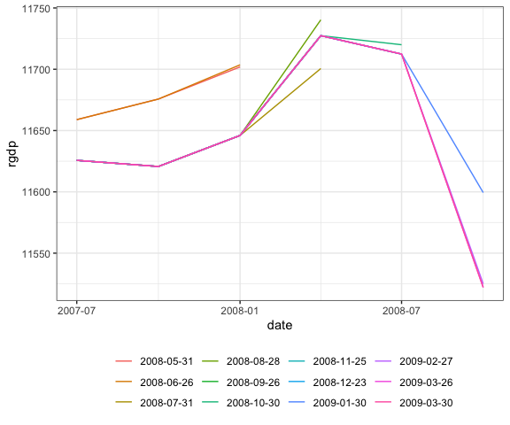

<!-- README.md is generated from README.Rmd. Please edit that file -->

# fedeconseries

<!-- badges: start -->

[](https://travis-ci.org/harrysun26/fedeconseries)
[](https://ci.appveyor.com/project/harrysun26/fedeconseries)
[](https://codecov.io/gh/harrysun26/fedeconseries?branch=master)
[](https://opensource.org/licenses/MIT)
<!-- badges: end -->

The goal of fedeconseries is to obtain US federal reserve economc data.
Reserach use only.

## Installation

You can install the released version of fedeconseries from github with:

``` r
#install.packages("fedeconseries")
library(devtools)
install_github("harrysun26/fedeconseries")
```

## Usage

A more detailed example can be found in my vignette:
<https://harrysun26.github.io/fedeconseries/index.html>

### Terms of use

When using the FRED© API, you are agreeing to be bound by the FRED© API
Terms of Use, see
<https://research.stlouisfed.org/docs/api/terms_of_use.html>.

## History

  - 02.02.2020: Version 1.0 release

## Example

This is a basic example which shows you how to solve a common problem:

``` r
library(fedeconseries)
## basic example code
```

``` r
library(fedeconseries)
df <- get_fred_series2("INDPRO", "indpro")
```

The output is a data frame

``` r
head(df)
#>         date indpro
#> 1 1919-01-01 5.0124
#> 2 1919-02-01 4.7908
#> 3 1919-03-01 4.6524
#> 4 1919-04-01 4.7355
#> 5 1919-05-01 4.7632
#> 6 1919-06-01 5.0678
```

This can be readily used, i.e. for plotting

``` r
library(ggplot2)
ggplot(df) +
  geom_line(aes(x = date, y = indpro))
```


## Vintage data

When using get\_fedeconseries for downloading real-time data sets, there
will be an additional column for the respective vintage dates.

``` r
df_vintages <-
  get_fedeconseries("GDPC1", "rgdp",
                    obs_start = "2007-05-31",
                    real_start = "2008-05-31", real_end = "2009-03-30")
head(df_vintages)
#>         date realtime_period    rgdp
#> 1 2007-07-01      2008-05-31 11658.9
#> 2 2007-10-01      2008-05-31 11675.7
#> 3 2008-01-01      2008-05-31 11701.9
#> 4 2007-07-01      2008-06-26 11658.9
#> 5 2007-10-01      2008-06-26 11675.7
#> 6 2008-01-01      2008-06-26 11703.6
```

Because of its output being a tidy data frame, it is easy to visualise
revisions by

``` r
library(ggplot2)

ggplot(df_vintages) +
  geom_line(aes(x = date, y = rgdp, colour = as.factor(realtime_period))) +
  theme_bw() +
  theme(
    legend.title = element_blank(),
    legend.position = "bottom"
  )
```


